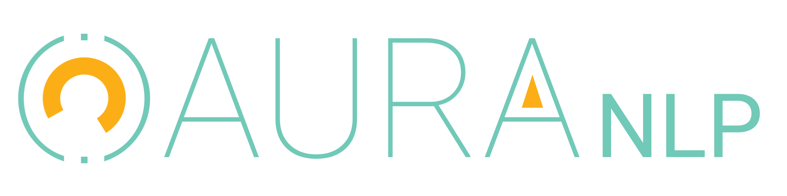

<p align="center">
    <br />
    
    
</p>

# Aura NLP

Microserviço para processamento de linguagem natural utilizado pela assistenve virtual [Aura](https://github.com/ccuffs/aura) para entendimento dos textos informados pelos usuários. A implementação é construída com base no pacote [nlp.js](https://github.com/axa-group/nlp.js).

## 🚀 Começando

### 1. Dependências

Para executar o projeto, você precisa ter o seguinte instalado:

- [Git](https://git-scm.com);
- [NodeJS](https://nodejs.org/en/);
- [NPM](https://www.npmjs.com/package/npm);

### 2. Configuração

Feito a instalação das dependências, é necessário obter uma cópia do projeto. A forma recomendada é clonar o repositório para a sua máquina.

Para isso, rode:

```bash
git clone --recurse-submodules https://github.com/ccuffs/aura-nlp && cd aura-nlp
```

Isso criará e trocará para a pasta `aura-nlp` com o código do projeto.

### 3. Utilizacão

#### 3.1 Rodando o projeto

Existem várias formas de rodar o projeto, como a api web, treino, etc. Para saber todas as opções, rode:

```bash
node aura.js
```

Todas as funcionalidades são baseadas no formato `node aura.js <comando>`, onde `<comando>` é o módulo que você deseja executar.


#### 3.2 Utilização da API

 Para iniciar o servidor web (api REST), rode o seguinte;

```bash
node aura.js serve
```

Após isso a aplicação estará rodando na porta 3000 e poderá ser acessada em [localhost:3000](http://localhost:3000).

> *DICA:* use `node aura.js serve -p 8080` para escolher a porta do servidor web.

A API web, com todos os endpoints, estará acessivel em `/api`, por exemplo [localhost:3000/api](http://localhost:3000/api). Por padrão, dois endpoints da api estão disponíveis:

- [localhost:3000/api/qna/](http://localhost:3000/api/qna) para perguntas e respostas;
- [localhost:3000/api/domain](http://localhost:3000/api/domain) para informações de domínio específico.

Faça um teste acessando [localhost:3000/api/qna/comida+favorita](http://localhost:3000/api/qna/comida+favorita).

Quando o servidor web é iniciado, você pode informar quais engines (e modelos) você deseja através do parâmetro `-e` (ou `--engine=`, cujo formato é `<nome>:/path/para/modelo.nlp, <nom>:/path/para/modelo.nlp, etc`). O exemplo abaixo inicia o servidor web com duas engines (`domain` e `qna`), informando onde os modelos dessas duas engines estão:

```bash
node aura.js serve -p 3000 -e "domain:./data/models/domain.model,qna:./data/models/qna.model"
```

### 4. Baixando e treinando novos modelos

O repositório vem com alguns modelos muito simples prontos para uso. O ideal é você treinar seus próprios modelos. Veja nas seções a seguir como treinar seus modelos.

#### 4.1 Usando uma planilha no Google Spreadsheets como dataset

A melhor forma de manter um dataset para outros contribuirem é utilizar uma planilha no [Google Spreadsheet](https://docs.google.com). Para tornar uma delas disponível para download, faça o seguinte:

1. Acesse a planilha
2. Escolha `File > Publish to the web`
3. Configure o tipo para `Tab-separated values (.tsv)
4. Clique `Publish`
5. Copie a URL resultante (será algo como `https://docs.google.com/spreadsheets/d/e/2PACX-1vS4GT7aqVyOHEGlSz-FPg1asFpq8ffoFwXFBoNiVQLR8uD6m2usl9t_bBwMm7VnXJoYvUFlV1HJRbJh/pub?output=tsv`).

Depois de publicar a planilha como TSV, você pode baixar e utilizar ela como dataset. Para isso, na raiz desse repositório, rode o seguinte comando (assumindo que a URL da planilha é a mesma do passo anterior; atualize a URL se sua planilha for diferente):

```bash
curl -L "https://docs.google.com/spreadsheets/d/e/2PACX-1vS4GT7aqVyOHEGlSz-FPg1asFpq8ffoFwXFBoNiVQLR8uD6m2usl9t_bBwMm7VnXJoYvUFlV1HJRbJh/pub?gid=0&single=true&output=tsv" > ./data/train/dataset.tsv
```  

Isso criará o arquivo `./data/train/aura-domain.tsv` que pode ser utilizado para treinos.

#### 4.3 Treinando um modelo

Para treinar um novo modelo, você precisa especificar a engine e o local onde o modelo será escrito. A engine é o estilo de dados que serão processados. Atualmente existem duas engines disponíveis: `domain` (conhecimento de domínio específico, inclusive NER) e `qna` (perguntas e respostas).

Para treinar um modelo para a engine `domain`, rode o seguinte:

```bash
node aura.js train --type="domain" --dataset="./data/train/aura-domain.tsv" --output="./data/models/domain.model"
```

Para treinar um modelo para a engine `qna`, rode o seguinte:

```bash
node aura.js train --type="qna" --dataset="./data/train/aura-qna.tsv" --output="./data/models/qna.model"
```

#### 4.4 Formato do dataset

Todas as engines são treinadas a partir de um arquivo `.tsv` (tab-separed values). As seções a seguir explicam o formato de treinamento de cada engine.

##### 4.4.1 Dataset `domain`

Para a engine `domain`, o formato do arquivo é o seguinte:

| type  |  category      |  nickname  | language  |          content            |
|-------|----------------|------------|-----------|-----------------------------|
|  ner  | hero           | spiderman  |    en     | Spiderman, Spider-man       |
|  ner  | hero           | iron man	  |    en     | Iron Man, Ironman, iron-man |
|  ner  | hero           | thor       |    en     | Thor                        |
|  ner  | food	         | burger	  |    en     | Burguer, Hamburguer         |
|  doc  | sawhero	     |            |    en     | I saw %hero% eating %food%  |
|  doc  | wanteat	     |            |    en     | I want to eat %food%        |
    
A coluna `type` informa o tipo da linha. Os tipos possiveis são `ner` (entidade nomeada) e `doc` (informação qualquer). Ambos os tipos tem uma coluna `category` que informa a categoria que aquela linha/entidade pertence, e uma coluna `language` que informa a linguagem.

Uma linha do tipo `ner` tem os seguintes atributos:
- `nickname`: nome curto para a entidade em questão;
- `content`: nomes reais da entidade, que são todas as variações possíveis do nome, separados por `,`.

Uma linha do tipo `doc` tem os seguintes atributos:
- `nickname`: __(não possui, então deixar vazio)__.
- `content`: frase que exemplifica o uso de alguma `ner`. Aqui você pode usar o nome de uma categoria de ner entre `%`, por exemplo, `%hero%` para se referir a todas as ners que sejam hero. A frase `I saw %hero% eating %food%` treinará o modelo para encontrar frases do tipo `I saw Thor eating Hamburguer` (`%hero%` é thor, `%food%` é burger).

##### 4.4.1 Dataset `qna`

Para a engine `qna`, o formato do arquivo é o seguinte:

| question                |  answer                 |
|-------------------------|-------------------------|
| Fale sobre você         | Sou uma agente virtual  |
| Porque você está aqui   | Porque é muito legal    |

Não há tipos de colunas, apenas uma organização no formato `pergunta \t resposta`. 

## 🤝 Contribua

Sua ajuda é muito bem-vinda, independente da forma! Confira o arquivo [CONTRIBUTING.md](CONTRIBUTING.md) para conhecer todas as formas de contribuir com o projeto. Por exemplo, [sugerir uma nova funcionalidade](https://github.com/ccuffs/aura-nlp/issues/new?assignees=&labels=&template=feature_request.md&title=), [reportar um problema/bug](https://github.com/ccuffs/aura-nlp/issues/new?assignees=&labels=bug&template=bug_report.md&title=), [enviar um pull request](https://github.com/ccuffs/hacktoberfest/blob/master/docs/tutorial-pull-request.md), ou simplemente utilizar o projeto e comentar sua experiência.

Veja o arquivo [ROADMAP.md](ROADMAP.md) para ter uma ideia de como o projeto deve evoluir.


## 🎫 Licença

Esse projeto é licenciado nos termos da licença open-source [MIT](https://choosealicense.com/licenses/mit) e está disponível de graça.

## 🧬 Changelog

Veja todas as alterações desse projeto no arquivo [CHANGELOG.md](CHANGELOG.md).

## 🧪 Projetos semelhates

Abaixo está uma lista de links interessantes e projetos similares:

* [Aura](https://github.com/ccuffs/aura)
* [nlp.js](https://github.com/axa-group/nlp.js)
